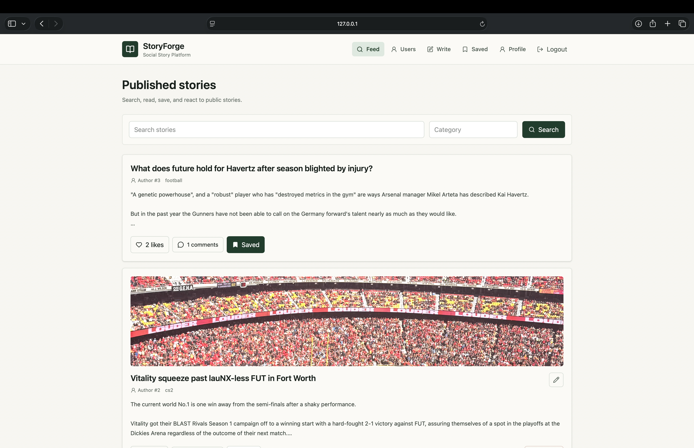
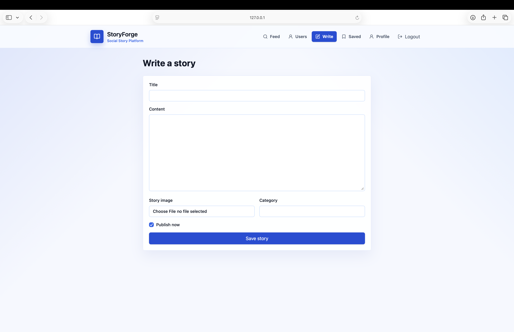
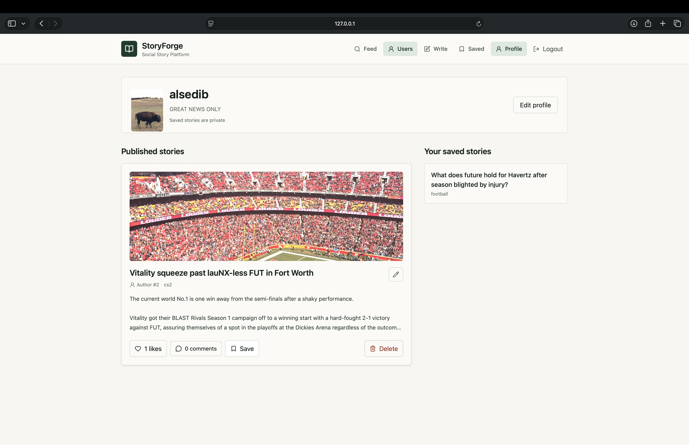
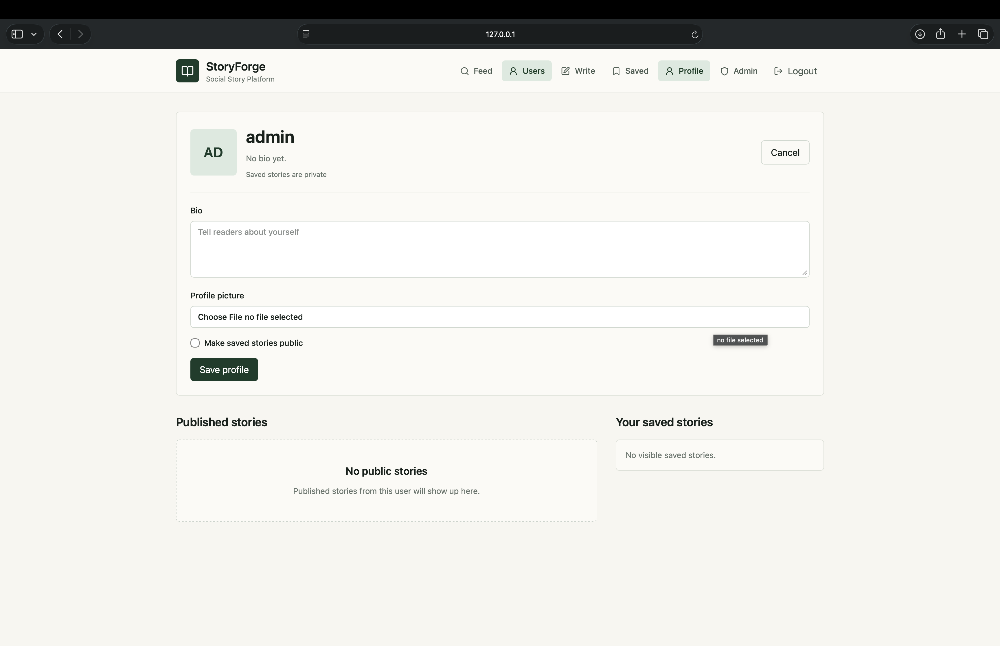
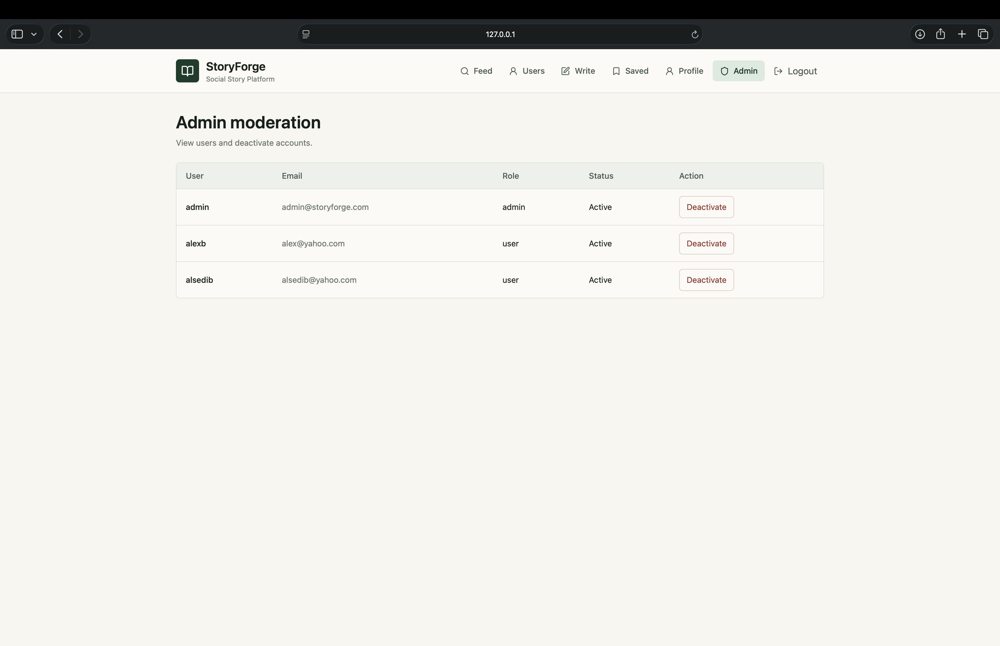

# 🛒 StoryForge

StoryForge is a full-stack social content platform where users can create, share, and interact with stories.  
The project was built to simulate a real-world product, focusing on authentication, user interaction, and scalable API design.

It includes a FastAPI backend, PostgreSQL database, JWT-based authentication, and a React frontend.

---

## 📸 Preview

### 🏠 Home Feed


### ✍️ Write a Story


### 👤 User Profile


### ⚙️ Edit Profile


### 🛡️ Admin Panel



---

## 🚀 What this project demonstrates

- Designing and building a full-stack application from scratch  
- Implementing authentication and role-based authorization (user/admin)  
- Structuring scalable APIs with FastAPI and SQLAlchemy  
- Handling real-world features like likes, comments, and saved content  
- Managing file uploads and serving media  
- Connecting backend and frontend in a clean architecture  

---

## 🧰 Tech Stack

### Backend
- Python + FastAPI  
- PostgreSQL  
- SQLAlchemy ORM  
- Pydantic  
- JWT authentication (`python-jose`)  
- Password hashing (`passlib`, `bcrypt`)  

### Frontend
- React (Vite)  
- Axios  
- TailwindCSS  
- React Router  

---

## ✨ Core Features

### Authentication & Security
- Register / login system  
- JWT-based authentication  
- Protected routes  
- Role-based authorization (user vs admin)  

---

### Stories
- Create, update, delete stories  
- Publish / unpublish functionality  
- Image upload support  
- Public story feed  
- Search, filtering, and pagination  

---

### User Profiles
- Public user profiles  
- Editable bio and profile image  
- View other users’ published stories  
- Optional public saved stories  

---

### Social Interactions
- Like / unlike stories  
- Comment on stories  
- Save (favorite) stories  
- Prevent duplicate likes and saves  

---

### Admin Capabilities
- View all users  
- Delete any story or comment  
- Deactivate user accounts  

---

### Media Handling
- Upload images locally  
- Store file paths in database  
- Serve images through FastAPI  

---

## 🧠 Key Design Decisions

- **JWT authentication** for stateless and scalable user sessions  
- **Role-based access control** to separate user and admin permissions  
- **Relational schema design** to handle user interactions (likes, comments, saved stories)  
- **Separation of concerns** between backend API and frontend UI  
- **Local file storage** as a simple and practical first step before cloud storage  

---

## 📊 API Overview

Main endpoints include:

- `/auth/*` → authentication  
- `/users/*` → profiles and search  
- `/stories/*` → story CRUD and feed  
- `/comments/*` → interactions  
- `/likes/*` → engagement  
- `/admin/*` → moderation  

Interactive API docs available at:

```
http://127.0.0.1:8000/docs
```

---

## ⚙️ Running the project

### Backend

```bash
cd backend
python3 -m venv .venv
source .venv/bin/activate
pip install -r requirements.txt
uvicorn app.main:app --reload
```

---

### Frontend

```bash
cd frontend
npm install
npm run dev
```

---

### Or run everything together

```bash
./run-dev.sh
```

---

## 🗄️ Database

PostgreSQL is used for structured data storage.

Tables include:
- users  
- stories  
- likes  
- comments  
- saved_stories  

The schema supports:
- user relationships  
- content ownership  
- interaction tracking  

---

## 🔐 Authorization Rules

- Users can manage only their own content  
- Admins can manage all content  
- Unpublished stories are private  
- Saved stories are private by default  

---

## 🔮 Future Improvements

- Refresh tokens  
- Email verification  
- Follow system  
- Notifications  
- Cloud storage (S3 / Cloudinary)  
- Deployment to production  

---

## 👤 Author

Alsedi Berdufi

## Note!
